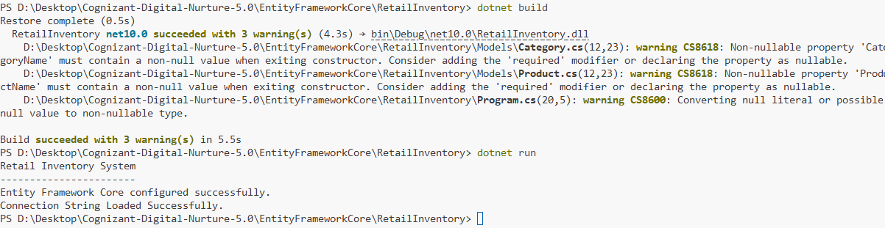

# Retail Inventory Management System

## Overview

Retail Inventory Management System is a console application developed using **Entity Framework Core 8** and **SQL Server**.

This project is built incrementally across multiple hands-on labs as part of the **Cognizant Digital Nurture 5.0** program.

---

## Objectives Completed

- ORM Fundamentals
- Entity Framework Core Setup
- SQL Server Configuration
- Entity Models
- DbContext Configuration

---

## Project Structure

```text
RetailInventory
│
├── Data
│   └── AppDbContext.cs
│
├── Models
│   ├── Product.cs
│   └── Category.cs
│
├── DTOs
│
├── Migrations
│
├── Output
│   └── Lab02_Output.png
│
├── Program.cs
├── appsettings.json
├── RetailInventory.csproj
└── README.md
```

---

## Technologies Used

- C#
- .NET
- Entity Framework Core 8
- SQL Server

---

## How to Run

Restore packages

```bash
dotnet restore
```

Build project

```bash
dotnet build
```

Run application

```bash
dotnet run
```

---

## Output

Store the execution screenshot inside

```text
Output/
```

Example

```text
Output/
└── Lab02_Output.png
```

---

## Output Screenshot

> Add the screenshot here after executing Lab 2.

```

```

---

## Author

**Nilanjan Pradhan**

Cognizant Digital Nurture 5.0
