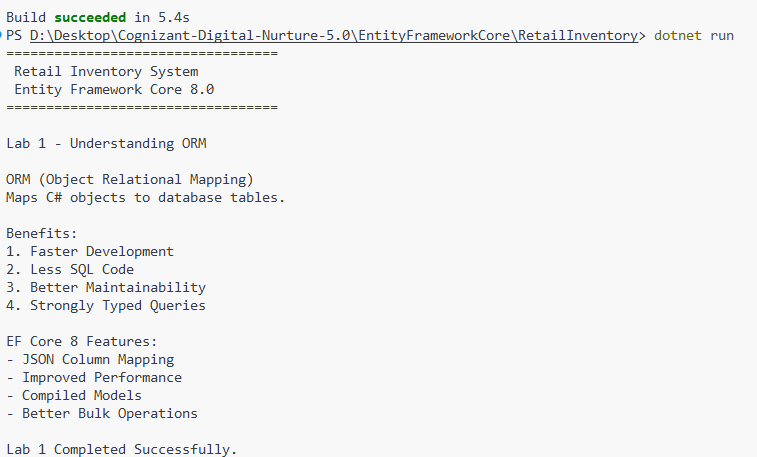

# Lab 1: Understanding ORM with a Retail Inventory System

## 👨‍💻 Developer Information

* **Name:** Nilanjan Pradhan
* **Assignment:** Cognizant Digital Nurture 5.0
* **Technology:** Entity Framework Core 8.0
* **Project:** Retail Inventory System

---

# 🧠 Problem Statement

Develop a Retail Inventory System using Entity Framework Core. Before implementing database operations, it is important to understand the concept of Object Relational Mapping (ORM), its benefits, and how Entity Framework Core simplifies database access in .NET applications.

---

# 🎯 Objectives

* Understand Object Relational Mapping (ORM)
* Learn the advantages of ORM over traditional SQL programming
* Compare Entity Framework Core with Entity Framework 6
* Explore the major features introduced in Entity Framework Core 8
* Set up the project structure for future EF Core development

---

# 📚 Concepts Covered

## What is ORM?

Object Relational Mapping (ORM) is a programming technique that maps C# objects to relational database tables.

Example:

| C# Class | SQL Table  |
| -------- | ---------- |
| Product  | Products   |
| Category | Categories |

Each object property corresponds to a column in the database table.

---

## Benefits of ORM

* Faster application development
* Reduces manual SQL writing
* Improves code readability
* Better maintainability
* Strongly typed queries
* Easier database management

---

## Entity Framework Core vs Entity Framework 6

| Feature             | EF Core 8 | EF6     |
| ------------------- | --------- | ------- |
| Cross Platform      | ✅         | ❌       |
| Linux Support       | ✅         | ❌       |
| Performance         | Excellent | Good    |
| Modern .NET Support | ✅         | Limited |
| Cloud Ready         | ✅         | Partial |

---

## Entity Framework Core 8 Features

* JSON Column Mapping
* Improved Query Performance
* Compiled Models
* Better Bulk Operations
* Interceptors
* Optimized LINQ Translation

---

# 📂 Project Structure

```text
RetailInventory/
│
├── Data/
├── DTOs/
├── Migrations/
├── Models/
├── Output/
│   └── Lab01_Output.png
├── Program.cs
├── RetailInventory.csproj
├── appsettings.json
└── README.md
```

---

# ▶️ How to Run

Navigate to the project directory:

```bash
cd EntityFrameworkCore/RetailInventory
```

Restore dependencies:

```bash
dotnet restore
```

Build the project:

```bash
dotnet build
```

Run the application:

```bash
dotnet run
```

---

# 📸 Output

The console output after successful execution is shown below.



---

# ✅ Outcome

Successfully understood:

* Object Relational Mapping (ORM)
* Benefits of ORM
* Entity Framework Core Architecture
* Entity Framework Core 8 Features
* Initial project setup for the Retail Inventory System

---

# 🚀 Next Lab

**Lab 2: Setting Up DbContext and SQL Server Connection**

The next lab will cover:

* Creating Entity Models
* Configuring DbContext
* Connecting to SQL Server
* Using `appsettings.json`
* Creating the first EF Core Migration
* Creating the database using Entity Framework Core
