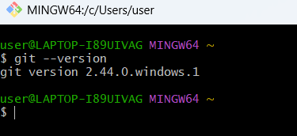
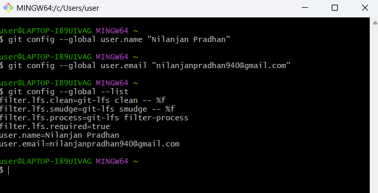

# Lab 01 - Git Configuration and First Repository

## Objective

The objective of this lab is to get familiar with basic Git commands and learn how to:

- Setup Git configuration on a local machine.
- Configure username and email in Git.
- Integrate Notepad++ with Git and set it as the default editor.
- Initialize a Git repository.
- Create, add, and commit files to a local repository.
- Connect a local repository with a remote GitHub/GitLab repository.
- Perform push and pull operations.

---

# Prerequisites

- Git Bash installed on the machine.
- GitHub/GitLab account.
- Notepad++ installed.
- Internet connection.

---

# Software Used

| Software | Purpose |
|----------|---------|
| Git | Version control system |
| Git Bash | Command-line interface for Git |
| Notepad++ | Default Git editor |
| GitHub/GitLab | Remote repository hosting |

---

# Step 1: Setup Machine with Git Configuration

## 1. Verify Git Installation

Git installation was verified using:

```bash
git --version
```

The command displayed the installed Git version, confirming successful installation.

### Screenshot



---

## 2. Configure Git Username

Command used:

```bash
git config --global user.name "Your Name"
```

---

## 3. Configure Git Email

Command used:

```bash
git config --global user.email "your_email@example.com"
```

---

## 4. Verify Git Configuration

Command used:

```bash
git config --global --list
```

The configured username and email were displayed successfully.

### Screenshot



---

# Step 2: Configure Notepad++ as Git Default Editor

## 1. Verify Notepad++ Availability

Command used:

```bash
notepad++
```

If Notepad++ was not recognized, its installation path was added to the system environment variables.

### Screenshot


---

## 2. Create Notepad++ Alias

The Git Bash profile was opened using:

```bash
notepad ~/.bashrc
```

The following alias was added:

```bash
alias np='notepad++'
```

The profile was reloaded:

```bash
source ~/.bashrc
```

---

## 3. Configure Notepad++ as Git Editor

Command used:

```bash
git config --global core.editor "notepad++"
```

---

## 4. Verify Default Editor

Command used:

```bash
git var GIT_EDITOR
```

Output confirmed that Notepad++ was configured as the default editor.

### Screenshot


---

# Step 3: Create a Local Git Repository

## 1. Create Project Directory

Commands used:

```bash
mkdir GitDemo
cd GitDemo
```

---

## 2. Initialize Git Repository

Command used:

```bash
git init
```

A new empty Git repository was created.

### Screenshot


---

## 3. Create welcome.txt File

Command used:

```bash
echo "Welcome to Git" > welcome.txt
```

---

## 4. Verify File Creation

Command used:

```bash
ls
```

---

## 5. Check File Content

Command used:

```bash
cat welcome.txt
```

Output:

```
Welcome to Git
```

---

# Step 4: Add File to Git Repository

## 1. Check Repository Status

Command used:

```bash
git status
```

The file was displayed as an untracked file.

### Screenshot


---

## 2. Add File to Staging Area

Command used:

```bash
git add welcome.txt
```

The file was successfully added to the staging area.

### Screenshot


---

## 3. Commit Changes

Command used:

```bash
git commit
```

Commit message:

```
Initial Commit

Created welcome.txt
```

### Screenshot


---

## 4. Verify Repository Status

Command used:

```bash
git status
```

The working tree was clean after successful commit.

### Screenshot


---

# Step 5: Create Remote Repository

A remote repository named **GitDemo** was created on GitHub/GitLab.

### Screenshot


---

# Step 6: Connect Local Repository with Remote Repository

Remote repository was added using:

```bash
git remote add origin <repository-url>
```

Remote connection was verified using:

```bash
git remote -v
```

---

# Step 7: Pull and Push Changes

## Pull Remote Repository

Command used:

```bash
git pull origin master
```

---

## Push Local Repository

Command used:

```bash
git push origin master
```

The local repository was successfully pushed to the remote repository.

### Screenshot


---

# Output

After completing this lab:

- Git was successfully installed and configured.
- User details were added to Git configuration.
- Notepad++ was integrated as the default Git editor.
- A local Git repository was created.
- Files were tracked and committed.
- A remote repository was connected.
- Changes were pushed successfully.

---

# Learning Outcome

By completing this hands-on lab, I learned:

- How to configure Git on a local machine.
- How Git tracks and manages files.
- How to initialize repositories.
- How to stage and commit changes.
- How to connect local repositories with remote repositories.
- How to synchronize repositories using Git push and pull commands.